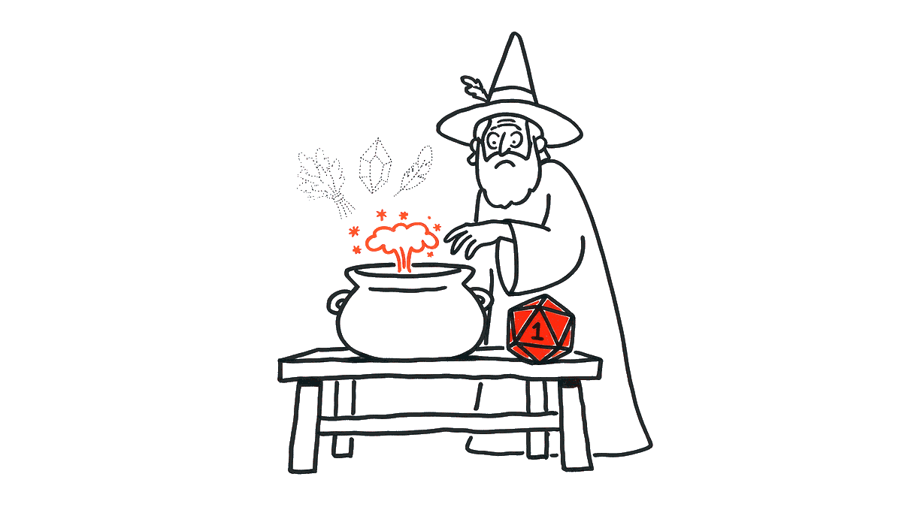

# Лаба 3 · «Крафт»

---

## Тикет

**От Гоши:** «Ввожу крафт в Патче 1.8. Рецепты приложил. Требование одно и жёсткое: **если крафт не удался, ингредиенты не тратятся**. На прошлом проекте тратились, все разнылись.

Код Валеры прикладываю, он успел его написать до увольнения. Запускается. Дальше сам.»

**От Марата, отдельным сообщением:** «И проверь, пожалуйста, что там с проверкой уровня. У меня персонаж двадцать пятого уровня крафтит вещи для сотого, и я не понимаю как. А ещё бот-тестировщик, у которого уровень в админке выставлен галочкой, тоже спокойно крафтит.»

---

## Правила

- **Рецепт** — какие ингредиенты нужны для изготовления предмета и в каком количестве, какой должен быть минимальный уровень игрока и какой шанс провала. Рецепты выданы в `recipes.py`.
- **Предмет** — словарь `{"name": "сталь", "quality": 3}`, качество от 1 до 5. У надетого предмета есть дополнительное свойство - `"equipped": True`.
- Крафт **возможен**, если:
  - существует такой рецепт;
  - уровень игрока — целое число от 1 более, не ниже требуемого рецептом. ;
  - каждого ингредиента в инвентаре игрока хватает. **Надетые предметы ингредиентами быть не могут**;
  - в инвентаре есть свободная ячейка чтобы положить результат крафта: `len(inventory) < CAPACITY`.   
  Гоша: «*результат появляется в инвентаре раньше, чем исчезают ингредиенты. Так работает клиент, не спорь*».
- Невозможный крафт должен приводить к **отказу**: `craft` бросает `ValueError` с описанием причины. Кубик при этом не бросают.
- Возможный крафт с некоторой вероятностью **может не получиться**. Для определения вероятности кидается "Кубик". Кубик — один вызов `random.random()` на попытку: попытка считается провальной, если выпало **строго меньше** `fail_chance` предусмотренного рецептом. При провале `craft` возвращает `None`.
- **Успех**: ингредиенты списаны, в конец инвентаря добавлен результат крафта по рецепту `{"name": <рецепт>, "quality": <худшее качество среди списанных>}`, и `craft` возвращает этот же словарь.
- Если подходящих предметов больше, чем нужно, списываются **лучшие по качеству**, из равных — те, что раньше в списке. Остальные предметы сохраняют порядок.
- **Крафт атомарен**: либо ингредиенты списаны и результат выдан игроку, либо не изменилось ничего — ни список, ни порядок, ни сами предметы. Провал и отказ — тоже «ничего».

---

## Что уже лежит в репозитории


| Файл                   | Что в нём                                                     |
| ---------------------- | ------------------------------------------------------------- |
| `recipes.py`           | `RECIPES` и `CAPACITY`. Не менять                             |
| `craft.py`             | здесь вы пишете `craft(inventory, recipe_name, player_level)` |
| `test_craft.py`        | ваши тесты, один пример уже есть                              |
| `conftest.py`          | фикстура `impl` и флаг `--impl`. Не менять                    |
| `mimic.py`             | Мимик для пятого пункта. Ваша часть — функция `mutants()`     |
| `valera_craft.py`      | крафт Валеры. Чинить не надо                                  |
| `check_craft.py`       | воспроизводит жалобы Гоши на коде Валеры                      |
| `check_level.py`       | воспроизводит жалобы Марата                                   |
| `deploy/run_server.sh` | как запускается прод                                          |


Тесты берут реализацию только из фикстуры `impl`: `def test_...(impl)` и внутри `impl.craft(...)`. Тогда одни и те же тесты гоняются на любом крафте:

```
python3 -m pytest -q                        # ваш craft.py
python3 -m pytest -q --impl valera_craft    # крафт Валеры
```

Нужен pytest: `pip install pytest`.

---

## Задания

### 1. Атомарный крафт

Реализуйте `craft` по правилам выше. Реализация крафта должна быть покрыта как минимум следующими тестами:

1. Happy path.
2. Не хватает ингредиента.
3. Пустой инвентарь.
4. Ингредиентов ровно столько, сколько нужно.
5. **Атомарность при провале**: крафт не удался — инвентарь остался в точности как до вызова.

В точности» — это больше, чем `==`. 

### 2. Тест, который валит реализацию Валеры

`python3 check_craft.py`

```
1. Провал на кубике
было : ['сталь', 'сталь', 'дерево']
стало: []
craft вернул None

2. Меч из одной стали
было : ['сталь', 'дерево']
ValueError: нет ингредиента: сталь
стало: ['дерево']
```

1. Валера списывает ингредиенты, а потом бросает кубик. 
2. Проверка ингредиентов у Валеры есть, но меч из одной стали она пропустила, и крафт упал посередине, успев списать сталь. Найдите почему. Сведите к короткому примеру и покажите, что лежит в `__closure__` у каждой проверки. 

Напишите тесты, которые **падают на коде Валеры и проходят на вашем**: `python3 -m pytest -q --impl valera_craft` должен быть красным. Тест, проходящий на обеих реализациях, засчитан не будет — он ничего не проверяет.

### 3. Сделайте тесты детерминированными

Крафт случаен, но тест обязан быть воспроизводимым через `unittest.mock.patch`.

Осторожно: у Валеры в первой строке `from random import random`. 

`check_craft.py`:

```
3. Подкручиваем кубик: 0.0 меньше любого шанса, крафт обязан провалиться
внутри patch('random.random')      : ['меч', 'меч', None, None, 'меч', 'меч', 'меч', 'меч', 'меч', 'меч']
внутри patch('valera_craft.random'): [None, None, None, None, None, None, None, None, None, None]
```

Первый вариант **хуже, чем просто неработающий**. Тест «подкрутили провал — ждём `None`» на коде Валеры не падает честно, а моргает: падает в среднем четыре раза из пяти. Тест «подкрутили успех — ждём меч» четыре раза из пяти проходит. 

Такой тест в CI выглядит как случайная неудача: его сначала перезапускают, потом помечают как flaky, потом отключают.

Требование: подкрутка кубика в ваших тестах работает для **обоих** стилей импорта. Автопроверка гоняет ваши тесты на двух эталонных крафтах — один пишет `import random`, другой `from random import random` — и заменяет настоящий кубик постоянным числом. Тест, который не дотянулся до кубика, падает каждый раз, а не четыре раза из пяти. 

### 4. Проверка уровня

Жалобы Марата:

```
$ python3 check_level.py
проверка уровня сработала: уровень мал для рецепта
бот с уровнем True скрафтил: {'name': 'факел', 'quality': 1}

$ python3 -O check_level.py
проверка уровня НЕ сработала. craft вернул: {'name': 'посох архимага', 'quality': 2}
бот с уровнем True скрафтил: {'name': 'факел', 'quality': 1}
```

Найдите, почему на проде проверка уровня не срабатывает. Посмотрите, как запускается прод, в `deploy/run_server.sh`. Потом разберитесь с ботом. Почему `isinstance(True, int)` — правда? 

В вашем крафте:

- проверка уровня работает одинаково с `-O` и без;
- `True` и вообще всё, что не целое число от 1, — отказ;
- есть тест, который **доказывает**, что проверка переживает `-O`. Автопроверка запускает ваши тесты обычным `python3`, так что режим `-O` тест должен устроить себе сам. Подсказка: `compile(source, filename, "exec", optimize=1)` компилирует модуль так, как его скомпилировал бы `python3 -O`; где лежит исходник модуля, подскажет `impl.__file__`.

### 5. Сломайте себя сами: Мимик

Код написан, тесты зелёные. **Давайте определим, насколько хороши тесты?**

Мимик  — код, который выглядит как ваш, но в каком-то месте отличается. `mimic.py` делает таких мутантов из вашего `craft.py` и гоняет на каждом из них ваши тесты. Допишите в нём `mutants()`: четыре вида правок описаны в её докстринге, делаются они через `ast.parse`, `ast.walk`, замену узла и `ast.unparse`. 

```
python3 mimic.py > mimic.txt
```

Так выглядит таблица:

```
  8  ВЫЖИЛ             строка 18: переставлены «for name, need in recipe['ingredients'].items():» и «if random.random() < recipe['fail_chance']:»
 17  убит              строка 15: «if len(inventory) >= CAPACITY:» заменено на pass
 41  убит              строка 24: if random.random() < recipe['fail_chance']:  ->  if random.random() <= recipe['fail_chance']:
```

Главное — выжившие. Часть из них **эквивалентные**: код другой, а поведение то же. Например, две независимые проверки поменялись местами. Такого мутанта не убьёт никакой тест. Но почти наверняка найдётся и настоящий: правка нарушает правило, а ни один ваш тест этого не проверяет. На защите покажите такого мутанта и объясните, какой инвариант он ломает и почему в ваших тестах не было проверки. Дописывать тест не обязательно, важнее показать, где именно дыра.

Своих мимиков держит и автопроверка — двенадцать штук. Каждый — эталонный крафт, в котором нарушено ровно одно правило из этого README. Ваши тесты должны заметить каждого. 

---

## Как сдавать

Пушим в `main`:

- `craft.py` — решение;
- `test_craft.py` — тесты: пять из пункта 1, тесты против Валеры (2), подкрутка кубика для обоих стилей импорта (3), уровень под `-O` и галочкой (4);
- `mimic.py` и `mimic.txt` — Мимик и его отчёт на вашем коде (5).

На каждый push прогоняются автопроверки, результат виден во вкладке **Actions** и в релизе `submit/...`.


| Автопроверка      | Что смотрит                                                                                    | Балл |
| ----------------- | ---------------------------------------------------------------------------------------------- | ---- |
| крафт по правилам | ваш `craft.py`: правила, отказы, атомарность, уровень под `-O`                                 | 1    |
| тесты надёжны     | ваши тесты зелёные на обоих эталонах, не зависят от настоящего кубика и красные на коде Валеры | 1    |
| тесты сильные     | ваши тесты ловят все двенадцать мимиков; `mutants()` в `mimic.py` делает мутантов              | 1    |


